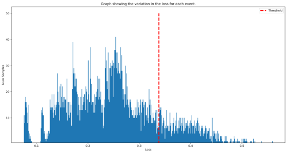

Table of Contents
=================

* [Cirium's HackAI Challenge - 2022#](#ciriums-hackai-challenge---2022)
   * [Aims](#aims)
   * [Solution](#solution)
      * [Team](#team)

# Cirium's HackAI Challenge - 2022#

 

## Aims

The aim of this hackathon was to process data about organized events and online flight query volumes to determine the events that lead to a spike in flight requirements, thus informing airlines about when flights should be scheduled.

***We have been asked to not publish the data and we respect Cirium's request. All references to the dataset have been expunged.***

## Solution

Our process uses an AutoEncoder NN to locate flight query volume anomalies that occur due to particular events. An autoencoder takes an input and performs an “encoding” (essentially a generalised PCA) on the input, resulting in a bottleneck of the most important features. A "decoding" is then performed on the bottleneck to reconstruct the input using only the features with largest variance. This reconstructed input can be compared with the original image by taking a mean absolute error between the input and the reconstructed input. 

This gives us an array of losses for each individual event. The sum of the mean and standard deviation losses represents the value for the threshold used for anomaly detection.

For a more detailed overview, you can download our presentation in the files or have a look here:
https://docs.google.com/presentation/d/1I-U3-zCT2FVroj4rzkMSEnIKHSEPsJTvHFEt0GWElgE/edit?usp=sharing

### Team

Team: Benjamin Sanati, Emil Stoev, Miroslav Milanov

From left to right: Benjamin Sanati, Miroslav Milanov and Emil Stoev
